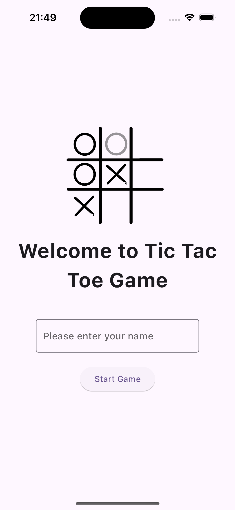
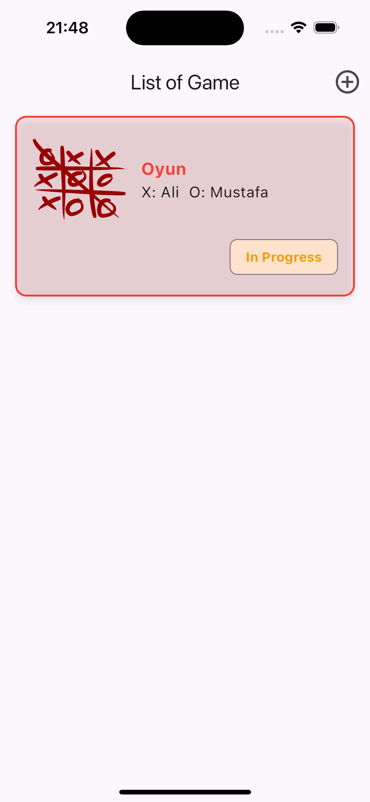
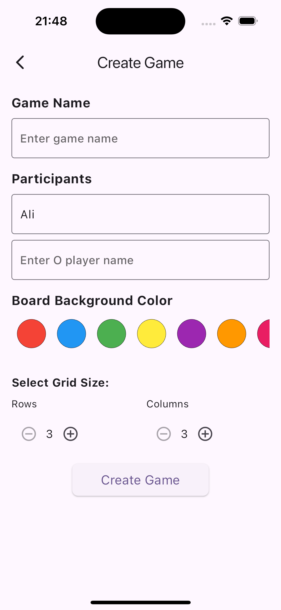
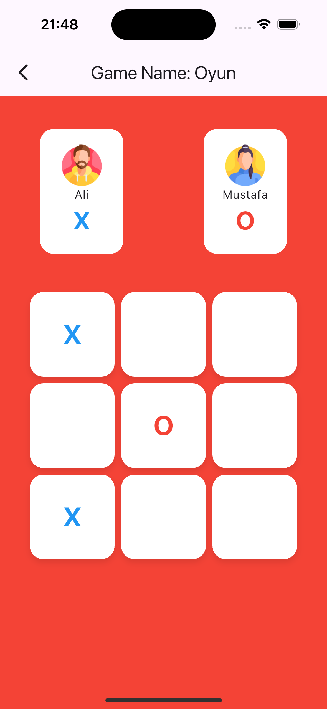

# Tic Tac Toe Game

## Project Overview

This project features a dynamic Tic Tac Toe game where users can select the number of rows and columns for the game board. The game board adjusts based on the user's selection, and the winning conditions are adapted accordingly. The project uses Supabase for real-time updates and user management.

## Features

- **Dynamic Game Board**: Users can choose the number of rows and columns for the game board on the start screen. The board is dynamically generated based on the selection.
- **Real-Time Updates**: Game data is updated in real-time using Supabase.
- **Winner Check**: Supports horizontal and vertical win conditions. Diagonal win conditions are only available for square boards.
- **User Identification**: Users participate in the game anonymously.

## Installation

### Requirements

- Flutter
- Supabase

## About Supabase

Supabase is an open-source Firebase alternative that provides backend services such as authentication, real-time databases, and storage. It is built on top of PostgreSQL and offers a rich set of features for developers to quickly build and scale their applications. 

In this project, Supabase is used to:

- **Manage User Authentication**: Users are authenticated anonymously and can interact with the game securely.
- **Store Game Data**: All game-related data, such as game state, player moves, and game results, are stored and managed in a real-time database.
- **Real-Time Updates**: Supabase's real-time capabilities ensure that game states are updated instantly across all connected clients.

For more information on Supabase, you can visit the [official website](https://supabase.io/).


### Installation Steps

1. **Clone the Flutter Project**:
   ```bash
   git clone <repository-url>
   cd <project-directory>

## Screenshots

|  |  |
|:--------------------------------------------:|:--------------------------------------------:|
| *Create User View*                                | *List of Game View*                        
|  |  
|:--------------------------------------------:|:--------------------------------------------:|
| *Create Game View*                           | *Game View*                               
